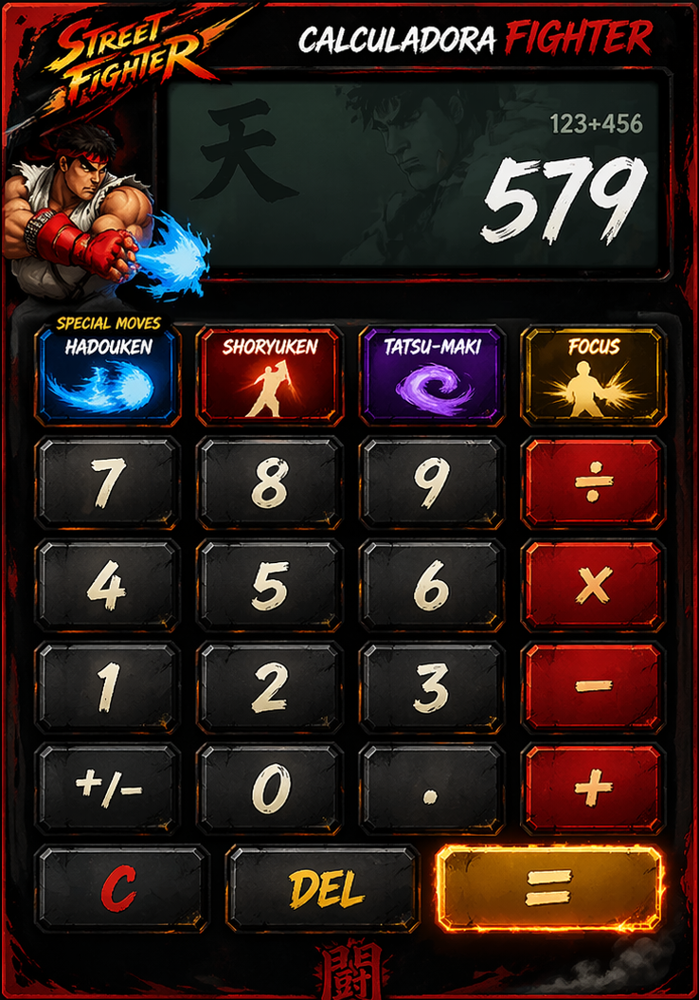
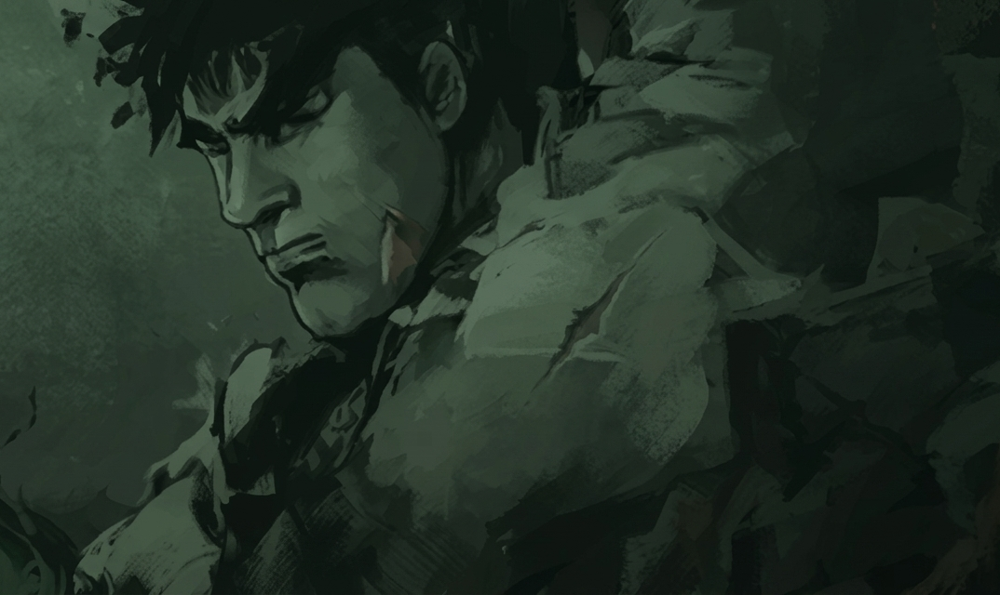

# 🎮 Street Fighter Calculator - Combo Edition


**Não é apenas uma calculadora. É um Round 1 contra a matemática!**

Este projeto transforma a experiência monótona de calcular em uma batalha de arcade. Inspirada no clássico *Street Fighter*, cada operação é um golpe e cada resultado é um nocaute.

---

## 🕹️ O Conceito
A ideia principal é gamificar o utilitário. No futuro, a calculadora deixará de apenas mostrar números para mostrar **combos**.
*   **Botões Numéricos:** Representam socos e chutes de diferentes intensidades.
*   **Operadores:** São os preparativos para o golpe especial.
*   **Botão Igual (=):** O "Finish Him" que executa o cálculo e dispara a finalização.

---

## 🖼️ Visual do Projeto
Aqui está o layout atual da interface (Custom UI):


| Tela Principal | Estilo Arcade |
| :---: | :---: |
|  |  |


---

## 🚀 Funcionalidades Atuais
- [x] **Interface Customizada:** Janela sem bordas nativas (estilo jogo).
- [x] **Draggable Window:** Arraste a calculadora clicando no painel superior.
- [x] **Sistema de Operadores:** Soma, Subtração, Multiplicação e Divisão.
- [x] **Feedback Visual:** O visor mostra o número atual e o operador selecionado.
- [x] **Toggle Negativo:** Botão `+/-` (NM) para inversão de valores.

---

## 🔮 Roadmap - Próximos "Special Moves"
Para não deixar a ideia fugir da cabeça, aqui estão os próximos updates planejados:

### 1. Sistema de Sprites Animados
- Adicionar uma `ImageView` que troca de frames (Idle -> Punch -> Hadouken).
- Quando clicar em números: Ryu faz um soco fraco.
- Quando clicar no `=`: Ryu solta um Hadouken na tela.

### 2. Efeitos Sonoros (SFX)
- Som de "Insert Coin" ao abrir o app.
- Voz do narrador dizendo "One!", "Two!" ao digitar.
- O clássico "HADOUKEN!" ao apertar o botão de igual.

### 3. Sistema de Combos Reais
- Se o usuário digitar uma sequência específica (ex: `2` `3` `6` `+`), ativar uma animação especial de combo na tela.
- Contador de "Combo Hits" baseado na quantidade de números digitados antes do igual.

### 4. Barra de Vida (HP Bar)
- Uma barra que diminui conforme você faz divisões ou subtrações, simulando o dano no oponente (a matemática).

---

## 🛠️ Tecnologias Utilizadas
*   **Java 21:** Linguagem base.
*   **JavaFX:** Interface gráfica e animações.
*   **Scene Builder:** Design visual do layout FXML.
*   **Maven:** Gerenciamento de dependências.

---

## 👨‍🏫 Como Rodar
1. Certifique-se de ter o **JDK 21** e o **Maven** instalados.
2. Clone o repositório.
3. Execute o comando:
   ```bash
   mvn javafx:run
   ```
   *Ou utilize o `AppLauncher.java` diretamente na sua IDE.*

---
*Desenvolvido com 🥊 por um fã de Fighting Games.*
